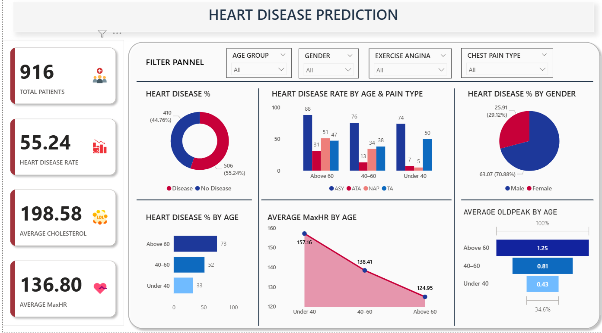

# Heart Disease Prediction Dashboard

This project involves analyzing patient health data to identify potential heart disease risks using SQL-based data cleaning and exploration, followed by interactive visualization in Power BI.

---

## Tools & Technologies Used

- **MySQL** – Data cleaning, filtering, transformation
- **Power BI** – Visual analytics and interactive dashboards
- **SQL** – Querying and exploratory data analysis (EDA)

---

## Key Features

- Cleaned and validated real-world heart patient data using SQL
- Created custom age groups, calculated heart disease percentages
- Funnel chart tracking high-risk patient filtering (Age, Cholesterol, Oldpeak)
- Built interactive Power BI dashboard with:
  - Pie charts, bar charts, line charts
  - Filters for Sex, AgeGroup, Chest Pain Type, etc.
  - Card visuals for Avg Cholesterol, MaxHR, Heart Disease %

---

## 📸 Dashboard Preview

---

## Outcome

- Built an end-to-end solution that cleans, analyzes, and visualizes patient data for early heart disease detection.
- Identified key risk factors (Oldpeak, Chest Pain Type, Cholesterol) through funnel filtering.
- Created insightful visual reports that assist healthcare professionals and decision-makers in understanding patterns of heart disease.

---

## Next Steps

- Improve dashboard using anomaly detection or predictive scoring
- Extend analysis with logistic regression or machine learning (Python)

---
